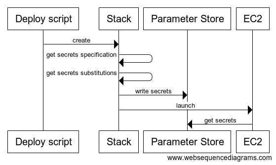

# aws-ruby

[](https://travis-ci.org/openstax/aws-ruby)

The `openstax_aws` gem helps you deploy your applications to AWS using CloudFormation.  It provides a layer on top of
the AWS SDKs to help coordinate common deployment steps and configurations.

The gem also includes utilities that use Packer and Ansible to help you build Amazon Machine Images (AMIs).

When using CloudFormation directly, you write template files that define AWS resources and their interconnections.  You
then make AWS API calls (either using the AWS CLI directly or one of the AWS SDKs) that tell AWS to build the resources
defined in those templates.  The resulting set of resources is called a stack.  The API calls involved are numerous and
repetitive.

In this gem, you don't make the AWS API calls directly.  Instead, you make "deployment" objects that organize and act on
sets of "stack" objects.  While not required to benefit from this gem, DSLs, convenience methods, and conventions let you
adopt a "convention over configuration" approach to dry up your code.

## A Quick Look

Let's assume we have a web API application defined in two CloudFormation templates: `app.yml` for the web server template
and `network.yml` for a template that sets up VPCs, subnets, etc.  The `app.yml` template defines one `ImageId` parameter
that is the AMI ID for the web server code and also connects to the network template by importing some of its values.
There is one Ruby file defining the deployment object, `web_api_deployment.rb`. And then there's an executable script to
call a method on the deployment, `create_deployment.rb`. Though not required, let's further assume that all files are in
the same directory:

```
/myapp $> ls
app.yml
network.yml
web_api_deployment.rb
create_deployment.rb
```

```ruby
# web_api_deployment.rb

class WebApiDeployment < OpenStax::Aws::DeploymentBase
  template_directory __dir__

  stack :network
  stack :app

  def initialize(env_name:, region:, dry_run: true)
    super(name: "web-api", env_name: env_name, region: region, dry_run: dry_run)
  end

  def create(api_image_id)
    network_stack.create(wait: true)
    app_stack.create(image_id: api_image_id)
  end
end
```

```ruby
# create_deployment.rb

deployment = WebApiDeployment.new(env_name: "production", region: "us-east-1", dry_run: false)
deployment.create("ami-0f71234567890a7f2")
```

Now let's call the script (making sure our AWS secrets are populated into our environment):

```
/myapp $> ./create_deployment.rb
I, [2019-04-26T09:13:58.133753 #12173]  INFO -- : Creating production-web-api-network stack...
D, [2019-04-26T09:14:29.543717 #12173] DEBUG -- : Waiting for production-web-api-network stack to be created... (0m30s elapsed)
D, [2019-04-26T09:14:59.923172 #12173] DEBUG -- : Waiting for production-web-api-network stack to be created... (1m1s elapsed)
I, [2019-04-26T09:15:00.306983 #12173]  INFO -- : production-web-api-network has been created!
I, [2019-04-26T09:15:01.133753 #12173]  INFO -- : Creating production-web-api-app stack...
D, [2019-04-26T09:15:31.543717 #12173] DEBUG -- : Waiting for production-web-api-app stack to be created... (0m30s elapsed)
D, [2019-04-26T09:16:01.923172 #12173] DEBUG -- : Waiting for production-web-api-app stack to be created... (1m1s elapsed)
I, [2019-04-26T09:16:02.306983 #12173]  INFO -- : production-web-api-app has been created!
```

That's it.  Now you have two stacks deployed with minimal fuss.  Behind the scenes, the gem found your
templates, validated them, uploaded them to S3, populated inferred template parameters and capabilities, made
standardized stack names, managed instance key pairs, waited for stacks to complete, and more.
Major functionality not shown in this example are the methods for updating and deleting deployments, as well as the mechanism for
conveying secret values to instances.

## Deployments & Stacks

In a deployment supported by this gem, `Stack` objects do the heavy lifting of calling CloudFormation APIs.
Deployment objects contain a number of `Stack`s and coordinate their use to effect the creation, updating, and
deletion of applications and infrastructure. For each application or separable infrastructure you'll have a
deployment class that inherits from `OpenStax::Aws::DeploymentBase`.

### Defining stacks (manually)

You can instantiate `OpenStax::Aws::Stack` objects directly.  E.g. your deployment class may look like:

```ruby
class MyDeployment < OpenStax::Aws::DeploymentBase

  attr_reader :network_stack, :app_stack

  def initialize(env_name:, name:, region:, dry_run:)
    super(env_name: env_name, name: name, region: region, dry_run: dry_run)

    @network_stack = OpenStax::Aws::Stack.new(
      name: "#{env_name}-#{name}-network",
      region: region,
      absolute_template_path: File.join(__dir__, "../../templates/network.yml"),
      enable_termination_protection: env_name == "production",
      parameter_defaults: {
        env_name: env_name
      },
      dry_run: dry_run
    )

    @app_stack = OpenStax::Aws::Stack.new(
      name: "#{env_name}-#{name}-app",
      region: region,
      absolute_template_path: File.join(__dir__, "../../templates/app.yml"),
      enable_termination_protection: env_name == "production",
      parameter_defaults: {
        env_name: env_name,
        network_stack_name: @network_stack.name,
      },
      dry_run: dry_run
    )
  end

  def create(app_image_id)
    @network_stack.create(wait: true)
    @app_stack.create(params: {image_id: app_image_id})
  end
end
```

You create instance variables, make them accessible via `attr_reader` and set a bunch of options.
A lot of these options end up being duplicated, and when you get into a deployment that has a bunch
of stacks, this duplication gets a bit heavy.

### Defining stacks (using the DSL)

This gem provides an alternative way to declare stacks.  The following code is equivalent to the
manual use of stacks above:

```ruby
class MyDeployment < OpenStax::Aws::DeploymentBase

  template_directory __dir__, "../../templates"

  stack :network
  stack :app

  def initialize(env_name:, name:, region:, dry_run:)
    super(env_name: env_name, name: name, region: region, dry_run: dry_run)
  end

  def create(app_image_id)
    network_stack.create(wait: true)
    app_stack.create(params: {image_id: app_image_id})
  end
end
```

Here, we've removed a good bit of code by calling the `stack` class method to define our two
stacks.  The `stack` method uses knowledge of the deployment in which it is called in addition
to some conventions to fill in smart defaults for many of the stack options.

* It makes the `:network` stack accessible via `network_stack`.
* It standardizes the stack name in AWS as `env_name-deployment_name-stack_symbol`, where any underscores
are replaces with hyphens.
* It sets the stack region to the the deployment's region.
* For the `:network` stack, it automatically finds template files named `network.yml` or `network.json`
in the declared `template_directory`.
* It enables stack termination protection if the deployment's environment name is the
production environment name (which itself is configured in the settings).
* It set's the stack's `dry_run` field to the deployment's `dry_run` value.
* It detects standard parameters in the template that it knows the values for, e.g. `EnvName`,
`KeyName` (or `KeyPairName`), and `[Anything]StackName` and fills in those values as the
stack's parameter defaults.

If you don't want to use this automagic setting of values, you can manually define a few of them:

```ruby
stack :app do
  region { "us-west-2" }
  absolute_template_path { File.join(__dir__, "../../templates/app_variant.yml") }
  parameter_defaults do
    env_name { "april-11-b" }
  end
end
```

Blocks passed to the stack definition methods (like `region` above) are executed in the context of the
containing deployment object.

When using the DSL, you can define a stack-local `template_directory` to override the deployment-level
one, e.g.

```ruby
stack :app do
  template_directory __dir__, "../somewhere/else"
end
```

You can also set a relative template path to override the inferred template filename (can be done
with or without local modification of the template directory):

```ruby
stack :app do
  relative_template_path "foo/app_2.yml"
end
```

### Working with stacks

Whichever way you choose to define your stack, your next step is to call methods to create, update, and
delete your stacks in AWS.  You do this with the `Stack` methods `create`, `apply_change_set`, and
`delete`.

Each of these methods takes a `wait` boolean (defaults to `false`), which will wait for the
operation to complete in AWS before returning.  You can also separately make a call to wait for stack
operations to complete, which is useful when you want to simultaneously run operations in several independent stacks
and then wait for all of them at the same time, e.g.

```ruby
network_stack.create   # these return immediately after starting the creation in AWS
sqs_stack.create       # (meaning all three happen concurrently)
dynamodb_stack.create

network_stack.wait_for_creation  # blocks until network_stack created
sqs_stack.wait_for_creation      # blocks until sqs_stack created (may have finished already)
dynamodb_stack.wait_for_creation
```

There are three waiter methods on `Stack`: `wait_for_creation`, `wait_for_update`, `wait_for_deletion`.

Other things to know about stacks:

* You can get stack output values by calling `my_stack.output_value(key: "whatever-the-key-is")`
* Stack parameter names are typically camel-cased in the template, but in Ruby we write them
underscored, so e.g. a `EnvName` parameter in the template is referred to in the ruby code as
`env_name`.  You'll also have noticed that the way we pass parameters is simplified so that we just
have to use Ruby hashes instead of the more verbose `ParameterKey` `ParameterValue` breakdown
used in the SDK.

#### `create`

If you call create on a stack that already exists, it by default

#### `apply_change_set`

[ Work on this section ]

When updating a stack, call `apply_change_set` with just the parameters you want to change.  The gem will build the
parameters to include in the update using the following algorithm:

1. First, every parameter in the currently-deployed stack that is also in the template being used in
the update will be included with a value of `:use_previous_value`.
2. Next, those parameters in the template being used in the update that are not already in the deployed
stack will be included with a default value defined in the stack definition (in the `parameter_defaults` block)
3. Next, "volatile parameters" are set. Volatile parameters are those that can change outside of stack updates (e.g. autoscaling group desired
capacities that change due to scaling events).  See below for more of a discussion of volatile parameters.
Volatile parameters will override any existing parameter values.
4. Finally, parameters explicitly set in the call to `apply_change_set` will be included.  These values
will override any existing parameter values.

Any parameter that ends up with a `nil` value after these series of steps will be removed.  Those parameters
will need to have a default value set in the CloudFormation template file to avoid the call failing within AWS.

##### `parameter_defaults`

Use the `parameter_defaults` section of the stack defintion to give default values for stack parameters.
Entries within the block are of the form `parameter_name value` or `parameter_name { value }`.  When the
latter block form is used, the block is executed in the context of the stack's deployment object when
the stack is first accessed.

```ruby
stack :app do
  ...
  parameter_defaults do
    web_server_desired_capacity 2
    some_other_parameter_name { "#{env_name}-blah" }
  end
  ...
end
```

Deployment-wide parameter defaults can be defined via a `parameter_defaults(parameter_name)` method on your
deployment class.  This method should return the default value given a parameter name (as it is shown in
the template), e.g.

```ruby
class MyDeployment < OpenStax::Aws::DeploymentBase
  ...
  def parameter_default(parameter_name)
    "my-log-bucket" if parameter_name == "LogBucketName"
  end
  ...
end
```

The `OpenStax::Aws::DeploymentBase` class provides a `built_in_parameter_default(parameter_name)` method
for some baseline defaults, e.g. for `"EnvName"` and parameters that are names of other stacks.  If you
want to disable these extra defaults, you can override the method and have it return nil.

```ruby
class MyDeployment < OpenStax::Aws::DeploymentBase
  ...
  def built_in_parameter_default(parameter_name)
    nil
  end
  ...
end
```

##### `volatile_parameters`

By and large, we want to make changes to our stacks using the update stack capabilities offered by AWS.
However, sometimes there are parameters that change outside of this update process.  The classic example
is autoscaling group desired capacity.  When we define an ASG in a template, we define its desired capacity
(if we don't, it defaults to the minimum allowed capacity).  If we give its desired capacity as a static number,
it'll have that value for each update, meaning that if we create it with a desired capacity of '2' and then
a scaling event causes the desired capacity to change to 6, an update through CloudFormation will reset the
desired capacity to 2.  Even if the capacity is not a literal number but instead a stack parameter, a stack
update call that uses the "use previous value" functionality will use the value last used during a stack update
and not the current value of the desired capacity in the stack.  What we want to do is get the stack's current
desired capacity and use that value in the stack update call so that the update leaves the capacity unchanged.

Volatile parameters let us do that.  They define the parameters that can change outside of stack updates and
define a block of code to run just before the update to get that latest value.  That value is then used in the
stack update.  The form within the `volatile_parameters` block is `parameter_name { value }` where the `{ value }`
block is executed in the context of the stack object, just before the call to update the stack.

```ruby
stack :app do
  ...
  volatile_parameters do
    web_server_desired_capacity { resource("Asg").desired_capacity }
  end
  ...
end
```

Here, we're getting the resource in our stack with the `Asg` logical ID (which returns an `Aws::AutoScaling::Group`
instance) and then getting its desired capacity.

#### `delete`

No options here besides `wait`.

#### `query`

A class method `query` is provided on the `Stack` class to find stacks matching certain criteria:

* `regex`: only queries whose name matches this regex will be returned (default: `/.*/`)
* `regions`: only stacks in these regions will be queried (default: US regions)
* `active`: if `true`, excludes stacks that have been deleted or that failed to create (default: `true`)
* `reload`: if `true`, forces cached query data to be reloaded (default: `false`)

```ruby
all_highlights_stacks_in_us = OpenStax::Aws::Stack.query(regex: /.*highlights.*/)
```

### Secrets

`openstax_aws` uses the AWS Parameter Store as a holding area for application secrets (and here "secrets" includes configuration values that are both secret and not secret).  During deployment, secrets are written to the Parameter Store, and then during instance launch they are read from the Parameter Store.



Secrets are defined with a *specification* and a set of *substitutions*.  A specification can currently be defined as a string or file containing YAML, like the following:

```yaml
secret_key: random(hex,4)
my_domain: "https://{{ domain }}"
search_domain:
  endpoint: "{{ search_endpoint }}"
```

The specification gives (possibly nested) secret names and the values for them, which can be literal values, values that need substitutions populated into them, computed values, or references to other values within the Parameter Store.  The specification can be defined inline:

```ruby
OpenStax::Aws::SecretsSpecification.from_content(
  format: :yml,
  content: <<~CONTENT
    graylog_url: ssm(graylog_url)
  CONTENT
)
```

or via a reference to a file on GitHub at a SHA:

```ruby
OpenStax::Aws::SecretsSpecification.from_git(
  org_slash_repo: "openstax/open-search",
  sha: some_sha_here,
  path: 'config/secrets.yml.example',
  format: :yml,
  top_key: :production
)
```

Why not just write the secrets to the instances directly?  In a world where we are deploying Amazon Machine Images or Docker containers across environments and clouds, we don't want the secrets to live in these files because (1) we don't want secret values written in plaintext in a the image file and (2) when launched those images/containers will need different secrets based on where they are launched.  This is why instead we work to get the secrets into an accessible location and then have the running app pull them when it needs them.

#### How secrets get written to the Parameter Store

When secrets are written to the Parameter Store, their nested structure is combined with a caller-specified namespace prefix to form the Parameter Store key.  E.g. for the following specification:

```ruby
a:
  b:
    c: "my value"
```

And a namespace of `qa/search/api`, the following is written to the Parameter Store:

```
Key:   /qa/search/api/a/b/c
Value: my value
```

When using the secrets DSL, the namespace is `env_name/deployment_name/stack_name`.

#### Kinds of secrets

In the specification, secrets can have literal values, e.g. `"some static string"`.  But the real power of secrets is that their values can be substituted, generated, or pulled in via reference:

##### Literal secrets

Specification:

```ruby
some_boring_secret: "this string never changes"
```

Result in Parameter Store:

```
Key:   /env_name/more_namespace/some_boring_secret
Value: this string never changes
```

##### Substituted secrets

Specification:

```ruby
a_substitution_secret: "this string's ending changes {{ ending }}"
```

Substitutions:

```ruby
ending: "oh yeah it does"
```

Result in Parameter Store:

```
Key:   /env_name/more_namespace/a_substitution_secret
Value: this string's ending changes oh yeah it does
```

##### Computed secrets

Computed secrets are good for generating random strings.

Specification:

```ruby
my_secret_key: random(hex, 8)
```

Result in Parameter Store:

```
Key:   /env_name/more_namespace/my_secret_key
Value: 019af8dc
```

Instead of `random(hex, number_of_hex_characters])` you can use `uuid` to get a UUID or `base64` to get a URL-safe base 64 string or `rsa(size_of_key)` to generate a private SSL RSA key. Note that generated secrets are only updated during a stack update if their specification changes (that way things like randomly generated secret keys don't change on each deployment unless how the value is computed changes).

Also note that if an array of secrets in the specification contains a generated secret, the overall `StringList` secret written to the parameter store is not marked as generated and so _would_ be changed in an update; the lesson of which is that this library only partially handles generative secrets in arrays.

##### Referential secrets

Referential secrets let you say that a secret should take the value of another parameter in the parameter store.  They
are good for defining static secret keys in the parameter store that are shared across many deployments, e.g.
some fixed OAuth keys or a common logging endpoint.

Assume that the parameter store has the following value:

```
Key:   /external/graylog/secret
Value: cf9bb194b53d76a557c8
```

Then in your specification:

```ruby
my_graylog_secret: ssm(graylog_secret)
```

Substitutions:

```ruby
graylog_secret: "/external/graylog/secret"
```

Result in Parameter Store:

```
Key:   /env_name/more_namespace/my_graylog_secret
Value: cf9bb194b53d76a557c8
```

We lookup the value inside `ssm(...)` using substitutions so that different environments can point to different
values in the Parameter Store, which is useful if you have say two secret values, one for development and one
for production deployments.

Note that you can also use referential secrets without substitutions:

```yaml
my_graylog_secret: ssm(/external/graylog/secret)
```

#### Encrypted Secrets

Most of the secrets we store are really just configuration values, and these we store in the Parameter Store with type "String".  However, the Parameter Store also lets us store parameters as "SecureString"s, which means that AWS encrypts them for us.  The secrets handling code can deal with these kinds of parameters.

When we use referential secrets the are SecureString encrypted, the secrets that are copied to an environment's section of the Parameter Store are also SecureString encrypted.

#### Secrets DSL

While you can instantiate secrets and specifications objects directly, it is easiest to use the DSL.  The DSL lets you define secrets on a per-stack basis:

```ruby
stack :api do
  ...
  secrets do |parameters|
    namespace "my-app/api"
    specification do
      org_slash_repo { "my-org/my-repo" }
      path { "config/secrets.yml.example" }
      sha { parameters.sha }
      format { :yml }
      top_key { :production }    # optional
      preparser { :erb }         # optional, use if your YAML file has embedded Ruby
    end
    substitutions do
      domain { domain }
      env_name { env_name }
      elasticsearch_endpoint { elasticsearch_stack.output_value(key: "endpoint")}
    end
  end
  ...
end
```

Specification and substitution blocks are executed in the context of the containing deployment.  If you have the `secrets` block take a `parameters` argument, that will give you access to the stack's parameters, which is useful for getting the SHA being deployed for the stack (so you can get the secrets specification to match the deployment).

You can call the `secrets` DSL multiple times within the `stack` declaration.  You may also call `specification` multiple times within the `secrets` call.  Later declarations can override earlier ones.

When stacks are updated, only the secrets that change are updated.

Sometimes multiple stacks share the same substitutions.  Instead of repeating those substitutions, you can define them once in your deployment class:

```ruby
class MyDeployment < OpenStax::Aws::DeploymentBase
  ...
  secrets_substititutions do
    domain { my_domain }
  end
  ...

  def my_domain
    "#{env_name}.example.com"
  end
end
```

Substitutions defined in this way will be overridden by any substitutions defined directly in the stack.

When you create, update, or delete a stack that uses the secrets DSL, the secrets are automatically created, updated, or deleted before the stack resources are modified.

Sometimes you might need to create secrets within a deployment but outside of any particular stack (e.g. to define a database password to be used by an RDS stack and API server stack).  You can use the secrets DSL at the deployment level just like you do at the stack level:

```ruby
class MyDeployment < OpenStax::Aws::DeploymentBase
  secrets :common do
    # same stuff here as for stack-level secrets
  end
end
```

These deployment-level secrets can then be accessed via `{ID}_secrets`, e.g. `common_secrets` in the example above.

You can define multiple deployment-level secrets, but they must all have unique names compared to each other and to defined stacks, e.g. you cannot do:

```ruby
  secrets :foo
  stack :foo
```

While stack-level secrets are created, updated, and deleted for you when you perform those actions on the stacks that contain them, deployment-level secrets must created, updated, and deleted explicitly.  E.g. you may have secrets that you create first thing inside
your deployment's `create` method:

```ruby
class MyDeployment < OpenStax::Aws::DeploymentBase
  secrets :common do
    specification do
      content do
        { database_password: 'random(hex,15)' }
      end
    end
  end

  def create
    common_secrets(for_create_or_update: true).create

    rds_stack.create(params: {master_password: common_secrets.get(:database_password)})

    # ...
  end
end
```

#### Loading secrets from the Parameter Store

When your instance or container launches, you'll want it to access its secrets in the Parameter Store so it can use them however is needed
in your application.

The key structure of each Parameter Store value helps you in two ways:

(1) You can limit your application's ability to read values in the parameter store by the namespace of each value, e.g. if you want
to limit the QA search deployment to access only the QA search secrets, you could use a CloudFormation template IAM policy such as:

```
- PolicyName: !Sub '${EnvName}-read-parameters'
  PolicyDocument:
    Version: '2012-10-17'
    Statement:
      - Effect: Allow
        Action:
          - ssm:DescribeParameters
        Resource: '*'
      - Effect: Allow
        Action:
          - ssm:GetParametersByPath
          - ssm:GetParameters
        Resource: !Sub 'arn:aws:ssm:${AWS::Region}:${AWS::AccountId}:parameter/${EnvName}/search'
```

(2) That the nesting of the keys from the secrets specification is preserved in the Parameter Store key lets you recover it when accessing your secrets.  E.g. here's how one of our apps uses the AWS Ruby SDK to take the secrets in the Parameter Store and writes them to the app's nested `config/secrets.yml` file:

```ruby
client = Aws::SSM::Client.new(region: region)
client.get_parameters_by_path({path: "/#{env_name}/#{namespace}/",
                               recursive: true,
                               with_decryption: true}).each do |response|
  response.parameters.each do |parameter|
    # break out the flattened keys and ignore the env name and namespace
    keys = parameter.name.split('/').reject(&:blank?)[2..-1]
    deep_populate(secrets, keys, parameter.value)
  end
end

File.open(File.expand_path("config/secrets.yml"), "w") do |file|
  # write the secrets hash as yaml, getting rid of the "---\n" at the front
  file.write({'production' => secrets}.to_yaml[4..-1])
end

def deep_populate(hash, keys, value)
  if keys.length == 1
    hash[keys[0]] = value
  else
    hash[keys[0]] ||= {}
    deep_populate(hash[keys[0]], keys[1..-1], value)
  end
end
```

#### Forcing servers to cycle when their secrets change

When an app's secrets change, we want their new values to be used by the app.  But our apps typically get their secrets when they launch, and launches happen when CloudFormation sees a change in the template that requires an update (e.g. a new AMI is specified).  When we make changes to the values in the Parameter Store, CloudFormation doesn't see them and therefore does not trigger an update of our servers.

This gem provides a mechanism for changes in secrets to trigger an update of the servers that use them.  When a stack update is called and the secrets defined within the stack (via the DSL) change, the gem will set a random value in a user-defined stack parameter.  If that stack parameter is then included in an ASG's launch configuration, CloudFormation will detect a change in that launch configuration and trigger a server update.

Here's a snippet of a template that will accept and use this special parameter:

```yaml
AWSTemplateFormatVersion: '2010-09-09'

Parameters:

  ...

  CycleIfDifferent:
    Description: A special parameter that will be set to a random value when this stack's secrets change
    Type: String
    Default: ''

Resources:

  ...

  Lc:
    Type: AWS::AutoScaling::LaunchConfiguration
    Properties:
      ImageId: !Ref 'WebServerImageId'
      InstanceType: t2.micro
      UserData:
        Fn::Base64:
          !Sub |
            #!/bin/bash -x

            # ${CycleIfDifferent} <-- this gets randomized when secrets change, which forces server updates
            ...

  Asg:
    Type: AWS::AutoScaling::AutoScalingGroup
    Properties:
      LaunchConfigurationName: !Ref 'Lc'
      ...
```

`CycleIfDifferent` is the default name of this special stack parameter.  This default can be overridden in the gem configuration via

```ruby
OpenStax::Aws.configuration.default_cycle_if_different_parameter = "MyPreferredParameter"
```

or it can be set within the `stack` declaration:

```ruby
stack :api do
  ...
  cycle_if_different_parameter "MyPreferredParameter"
  ..
```

### Tags

You can specify stack tags with:

```ruby
stack :network do
  ...
  tag :Foo, "bar"
  ...
end
```

You can specify tags in all of a deployment's stacks by setting the tags at the deployment level:

```ruby
class MyDeployment < OpenStax::Aws::DeploymentBase
  tag :Application, "my_app"
  tag :Owner, "Jimmy"
  tag(:Environment) { env_name }
  ...

  def env_name
    @env_name
  end
```

Note the block form of `tag` sets the tag value by evaluating the block in the context of the deployment instance,
in this case by calling `env_name` on the deployment instance.

Tags set at the stack level will override those set at the deployment level.

You can enforce that stacks always have certain tags by setting `OpenStax::Aws.configuration.required_stack_tags`.  By default, there
are a few required tags; if you want to disable this, set this variable to `[]`.

### Dry runs

You'll have noticed above that deployment and `Stack` objects are instantiated with a `dry_run` parameter
that defaults to `true`.  When `dry_run` is true, stacks are not created, updated, or deleted, but the
code is exercised and log messages are generated.  Note that during dry run updates, CloudFormation change
sets are temporarily created on AWS but they are not executed.

### Configuration

You can configure gem behavior with:

```ruby
OpenStax::Aws.configure do |config|
  # The bucket where you want to upload templates
  config.cfn_template_bucket_name = "some-bucket-name"
  # The top-level folder(s) where templates are stored in the template bucket.
  # (default: "cfn_templates")
  config.cfn_template_bucket_folder = "cfn_templates"
  # A logger object, e.g. `Logger.new(STDOUT)` (the default); see below for more.
  config.logger = Logger.new(STDOUT)
  # The number of seconds the gem waits between polling for the completion of stack creation,
  # updates, deletes. (default: 30)
  config.stack_waiter_delay = 30
  # The number of maximum attempts the gem makes to check for the completion of stack creation,
  # updates, deletes. (default: 180)
  config.stack_waiter_max_attempts = 180
  # If true, the gem will parse your template and autoset the required capabilities
  # (default: true)
  config.infer_stack_capabilities = true
  # If true, the gem will set default values for parameters that it knows about (e.g.
  # EnvName, default: true)
  config.infer_parameter_defaults = true
  # The environment name you use for production, e.g. "prod" or "production" (the default).
  config.production_env_name = "production"
end
```

We use the logger configuration below:

```ruby
config.logger = Logger.new(STDERR)
config.logger.formatter = proc do |severity, datetime, progname, msg|
  date_format = datetime.strftime("%Y-%m-%d %H:%M:%S.%3N")
  if severity == "INFO" or severity == "WARN"
      "[#{date_format}] #{severity}  | #{msg}\n"
  else
      "[#{date_format}] #{severity} | #{msg}\n"
  end
end
```

### Templates

While you won't usually use it directly, there is an `OpenStax::Aws::Template` object that you can
use to get values back from your template.  A stack's template is available via `my_stack.template`.
Templates are uploaded to S3 when its `Stack` needs it to be there.  Before it is uploaded, it is
validated and errors are raised to you.

### AutoScalingInstance

An `OpenStax::Aws::AutoScalingInstance` class is provided that wraps and extends the `Aws::AutoScaling::Instance`
class.  Methods that it doesn't implement are delegated to the AWS SDK class.

It has a class method, `me`, that returns an `AutoScalingInstance` for a instance running within AWS.  This
method requires the `autoscaling:DescribeAutoScalingInstances` permission on the instance calling this method
or attached to the credentials being used to call this method.

It has ASG-lifecycle-hook-aware methods, e.g. its implementation of `terminate` takes the same arguments as the
SDK class (`should_decrement_desired_capacity`) but also takes an `continue_hook_name` parameter with a
termination lifecycle hook name.  If that parameter is provided, the `terminate` call will wait for the
lifecycle state `Terminating::Wait` to be reached before calling the SDK client to continue on from that
state to complete the termination.

It also has an `unless_waiting_for_termination` method that checks to see if the instance is in the
`Terminating::Wait` state. If it isn't, the block of code passed to the method is executed.  If it is
in that state, the block of code isn't executed and instead the termination is completed.

```ruby
OpenStax::Aws::AutoScalingInstance.me.unless_waiting_for_termination do
 # some code that you don't want interrupted by a termination
end
```

The `unless_waiting_for_termination` method checks for the terminating wait state just before and
just after the block is yielded to.

### S3TextFile

`S3TextFile` is a helper class for writing, reading, and deleting text files on S3.

```ruby
s3_text_file = OpenStax::Aws::S3TextFile.new(bucket_name: "my-bucket", bucket_region: "us-east-2", key: "some/path/foo.txt")
s3_text_file.write(string_contents: "Howdy")
s3_text_file.read #=> "Howdy"
s3_text_file.delete
```

Raises `Aws::S3::Errors::NotFound` when trying to `read` a file that does not exist.  Calling `delete` on a file that doesn't
exist does not raise an error.

You can also set the content type and cache control headers, e.g.:

```ruby
s3_text_file.write(string_contents: "...", content_type: "application/json", cache_control: "max-age=0")
```

### Other deployment methods and utilities

[ Work on this section ]

## AWS Development Environment

Some methods, e.g. those that retrieve instance metadata, are intended to be run on an actual AWS
instance.  This means that to test them we must be running the tests on an AWS instance.  To this
end, this gem provides a bash script that creates a stack with an autoscaling group containing one
instance.

```
$> bin/create_development_environment
```

You can find the instance's IP address in the AWS console, and then SSH into it.  Once there you
can install ruby, etc, to get the development environment set up.  There is a script, `install.sh`
that has the commands you can use to install ruby et al.

Then you can checkout this gem, do your development through SSH, record specs, etc, and commit
your changes.

Don't forget to delete your stack (from the console) when you are finished!

## README Todos

1. Discuss use of multiple secrets objects
